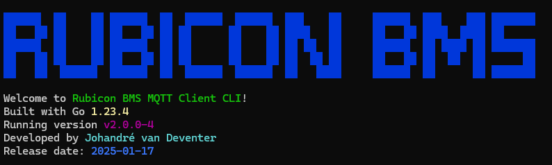

# BMS MQTT Client



bms-mqtt-client is a Golang program for running a MQTT client and subscribing to a specific topic.

## Prerequisites
- [Go](https://go.dev/) version: >1.23.4
    ```bash
    go version
    ```
    If your version is older, upgrade Go.

## Installation

Use the ```go mod tidy``` command  to download and install all required dependencies:
```bash
go mod tidy
```
This will:
- Download missing dependencies.
- Remove unused dependencies.

## Usage

If it is your first time running the program, run the following command to create the necessary config files in ```./config```. (There are two example files provided.)
```bash
go run cmd/app/main.go --init
```

This is where you will set all the parameters for the program.

After that, you can run the program normally with
```bash
go run cmd/app/main.go
```

Below is a list of arguments that can be used while starting the program:
- ```--v```: Provides the version details of the program.
- ```--d```: Runs the program in debug mode.
- ```--e```: Used to set the environment. ("p" for production and "d" for development)
- ```--help```: Supplies help for the available arguments.

## Contributing

Pull requests are welcome. For major changes, please open an issue first
to discuss what you would like to change.

## License

[MIT](https://choosealicense.com/licenses/mit/)